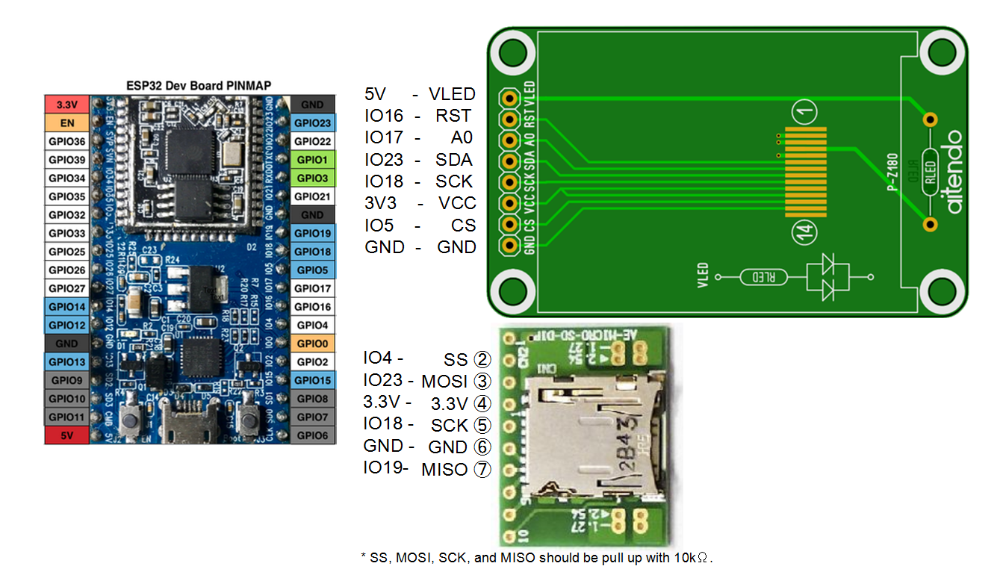
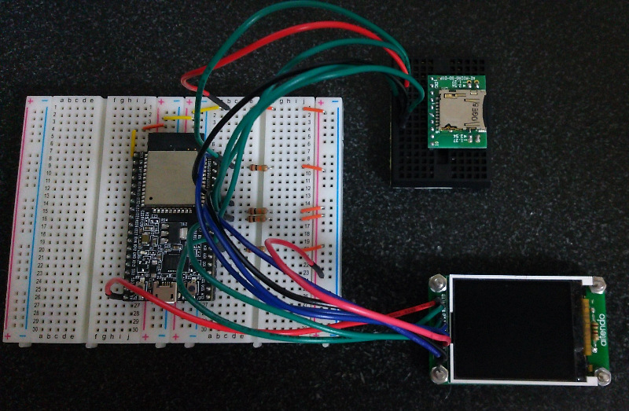
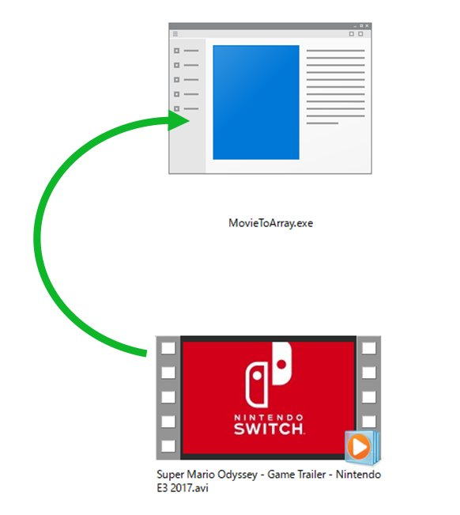
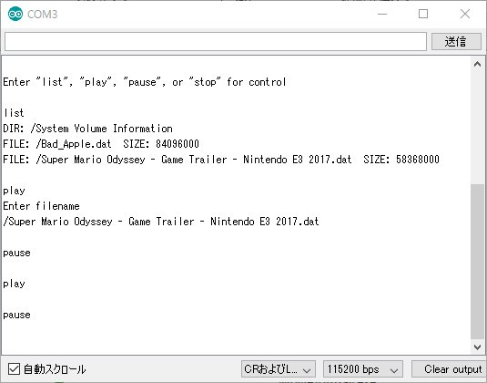

# esp32_ST7735_Movie

## Prepare
- [ESP32-DevKitC](http://akizukidenshi.com/catalog/g/gM-11819/) ESP32 : 秋月電子
- [M-Z18SPI-2PB](http://www.aitendo.com/product/15420) TFT color LCD : Aitendo
- [AE-MICRO-SD-DIP](http://akizukidenshi.com/catalog/g/gK-05488/) Micro SD Card slot : 秋月電子

## Wiring

## Development Environment
- [Arduino IDE](https://www.arduino.cc/en/main/software)
- [arduino-esp32](https://github.com/espressif/arduino-esp32)

## How to play Movie
In your PC, drag and drog a avi file into MovieToArray/MovieToArray.exe 

And you can get a dat file.  Put the file into a SD card and set it to the slot.
You can play the dat file on Serial Monitor.

## About MovieToArray.exe
It uses DLL for Microsoft Expression Encorder 4.
https://www.microsoft.com/ja-jp/download/details.aspx?id=18974
You can build it from MovieToArray/Program.cs which is written by C# as a simple console program.
(You must add "Microsoft.Expression.Encoder" and "System.Drawing" by reference manager when you build it in Visual Studio.) 